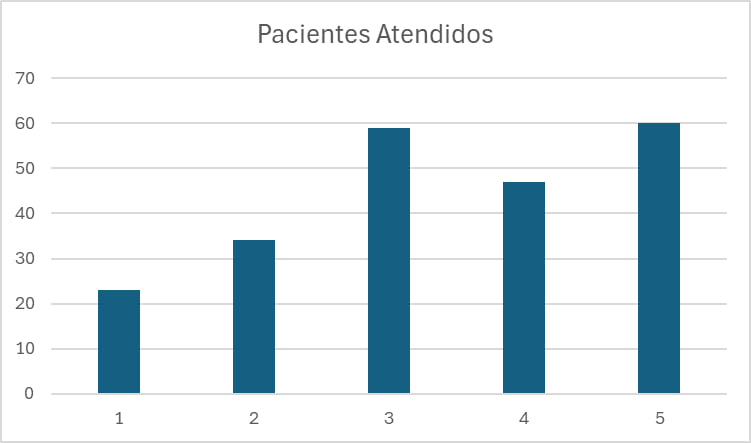
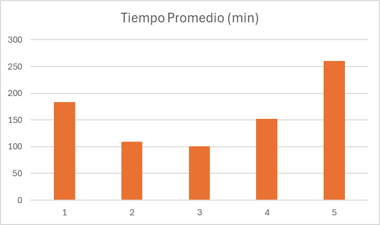
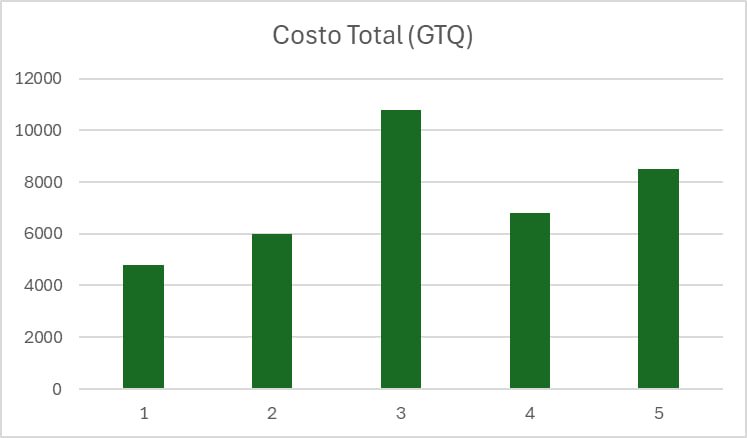
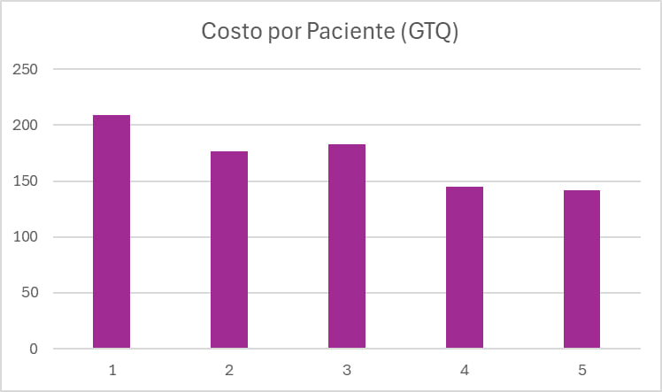
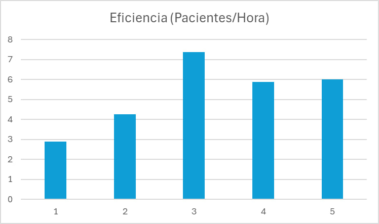
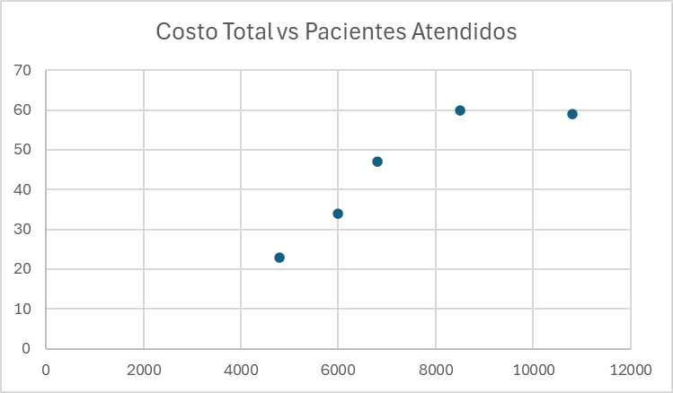
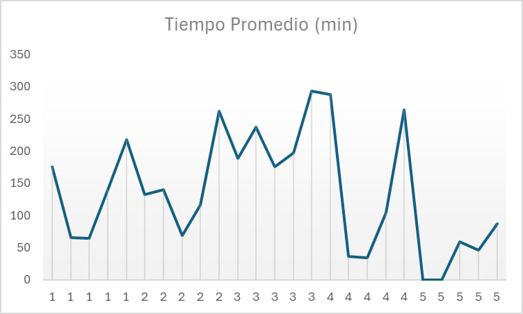

# HDT8 - Estructuras de Datos
Repositorio: https://github.com/MarceloDetlefsen/HDT8.git

# Descripción del Programa
Implementación de un sistema de atención de pacientes en emergencias hospitalarias utilizando Priority Queues, que incluye:

1. **Parte Java**:
   - Clase `Paciente` con prioridades A-E
   - Implementación de `VectorHeap` personalizado
   - Versión usando `PriorityQueue` de JCF
   - Simulación completa del flujo de atención

2. **Parte Python**:
   - Simulación DES con SimPy del sistema de emergencias
   - Modelado de recursos limitados (doctores, equipos)
   - Análisis estadístico de tiempos de atención
   - Recomendaciones de configuración óptima

# 🛠️ Instalación y Ejecución
1. Clonar el repositorio:
    ```bash
    git clone https://github.com/MarceloDetlefsen/HDT8.git
    cd HDT8
    ```

2. Compilar el programa:
    ```bash 
    cd demo
    javac -d out src/main/java/com/hdt8/*.java
    ```

3. Ejecutar la parte 1:
    ```bash
    cd out
    java com.hdt8.SimulacionJava
    ```

4. Ejecutar la parte 2:
    ```bash
    cd out
    python SimuladorHospital.py
    ```

# Explicación de los Términos en la Simulación
   - **Configuración 1 / Básica:** Enfermeras = 1, Doctores = 2, Rayos X = 1, Laboratorios = 1.
   - **Configuración 2 / Intermedio:** Enfermeras = 2, Doctores = 3, Rayos X = 1, Laboratorios = 1.
   - **Configuración 3 / Avanzado:** Enfermeras = 3, Doctores = 5, Rayos X = 2, Laboratorios = 2.
   - **Configuración 4 / Fin de Semana:** Enfermeras = 2, Doctores = 4, Rayos X = 1, Laboratorios = 1, Intervalo de Llegada = 3.
   - **Configuración 5 / Feriado:** Enfermeras = 2, Doctores = 4, Rayos X = 1, Laboratorios = 1, Intervalo de Llegada = 1.5, Tiempo de Simulación = 600.

*El intervalo de llegada representa el tiempo promedio entre la llegada de pacientes al hospital, el estándar establecido es cada 5 minutos.

*El tiempo de simulación representa la duración total de la simulaciín en minutos, el valor estándar es 480 lo cual representa 8 horas.

# Resultados Simpy














# Análisis de los Resultados
La mejor decisión entre las cinco configuraciones evaluadas es la Configuración 3. Aunque presenta un costo total elevado (GTQ 10,800.00), ofrece la mejor eficiencia con 7.38 pacientes atendidos por hora y el menor tiempo promedio de atención general (100.72 minutos) con la desviación estándar más baja (61.88 minutos), lo cual indica un servicio más consistente y predecible. Además, distribuye adecuadamente la atención entre diferentes prioridades, especialmente aquellas más críticas (Prioridades 1 y 2). Aunque su costo por paciente (GTQ 183.05) no es el más bajo, es razonable considerando la alta eficiencia lograda.

# Investigación
Esta simulación se basa en datos disponibles sobre el sistema de salud de Guatemala para intentar reflejar condiciones realistas en una sala de emergencias. Debido a la limitada disponibilidad de datos específicos para todos los parámetros, se utilizaron las mejores estimaciones disponibles de diversas fuentes.

**Tiempo de Triage:** Se encontró una guía del Instituto Guatemalteco de Seguridad Social (IGSS) que establece que el proceso de clasificación de pacientes (triage) no debería tomar más de 5 minutos. La simulación original utilizaba un rango de 8 a 12 minutos, por lo que este hallazgo sugiere que podría ajustarse para ser más realista.   

**Salarios del Personal de Salud:** Se investigaron los salarios promedio de enfermeras y médicos en Guatemala. Para enfermeras, se encontraron reportes de salarios mensuales promedio que oscilan entre Q3,000 y Q8,000, con un promedio alrededor de Q4,040 . Para médicos, los salarios varían significativamente según la especialidad y el sector (público o privado), con reportes que van desde Q7,301 por cuatro horas en el sector público hasta cifras mucho más altas en el sector privado . Los costos por hora utilizados en la simulación (Enfermera: Q50/hora, Doctor: Q100/hora) se consideran estimaciones razonables dentro de este rango, especialmente para un entorno de emergencia.

**Capacidad Hospitalaria:** Datos del Banco Mundial y otras fuentes indican que Guatemala tiene una de las densidades de camas de hospital más bajas de la región, con menos de una cama por cada 1,000 habitantes . En 2016, se reportó un promedio de 34 camas por hospital . Esta información contextualiza la capacidad limitada del sistema de salud.

**Otros Parámetros:** Para otros parámetros como la tasa de llegada de pacientes, el porcentaje que requiere exámenes y el tiempo de los exámenes, no se encontraron datos específicos para Guatemala en las fuentes consultadas. En estos casos, la simulación utiliza valores estimados o rangos basados en la lógica del proceso de atención de emergencias.

# Referencias
   - https://gt.computrabajo.com/salarios/medicosas
   - https://gt.computrabajo.com/salarios/enfermera
   - https://gt.computrabajo.com/salarios/medico-general
   - https://www.trade.gov/market-intelligence/guatemala-healthcare-infrastructure
   - https://www.homehospital.com.gt/post/cu%C3%A1nto-gana-una-enfermera-en-guatemala

# Autores
👨‍💻 Marcelo Detlefsen
👨‍💻 Julián Divas